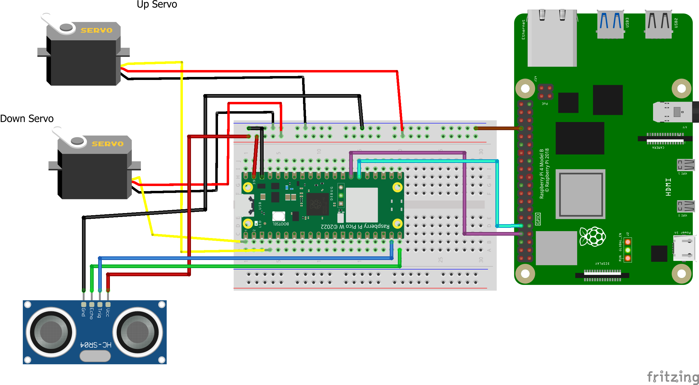

# ✋ High Five

Imagine being alone in your room, debugging your code at 5 AM, solving a tough equation, or solo-queuing in Valorant and acing a round. You’re pumped, but no one’s awake to share the excitement. To solve this problem, meet **High Five™** — a robotic arm based on the Raspberry Pi Pico that won’t leave you hanging!

You don’t need to lose focus on your game: using an ultrasonic sensor, it detects when your hand is near, waiting for a high-five, and positions itself at hand level.

_"But wouldn’t it interrupt my intense gaming session?"_ Nope! Its exquisite design lets it go flat into `sleep mode`  whenever no hand is detected.

For devs who want full control of each motor or access to raw distance data, there’s even a **web-based control panel** — just connect to it, and everything is at your fingertips.

**LINK FOR DEMO:**
<a href="https://www.youtube.com/watch?v=fgNwqBOAN3E">
  
</a>
---

## 🚀 Features
- Acts like a friend when you need one.
- Senses your hand position so you can keep grinding your elo.
- Has a website for further control.
---
## ⚡ Skills / Technologies Used
- **Hardware:** Raspberry Pi Pico 2W, Raspberry Pi 4B, SG90 Servo Motors, HC-SR04 Ultrasonic Sensor  
- **Programming:** C++ (Pico SDK), Python  
- **Web:** Flask, Flask-SocketIO, HTML/JS for control panel  
- **Communication:** UART, WebSocket  
- **Tools:** VSCode, Git, GitHub
---
## 🔨 Building the Robotic Arm
For that you need:
- **Raspberry Pi Pico** (I'm using the 2W version, it is important for operating the debug LED. I don't know why but the SDK treats different the LED onboard of the 2W version and the regular 2).
- **2 Servo motors**. I'm using the SG90.
- **Ultrasonic Sensor**, like the HC-SR04.
- **Jumper Wires**
- Optional: for the control panel there is also a need for **Raspberry Pi**. I'm using the 4B model. (It is completely unnecessary for the operation of the arm, I used it for debug. Yes I could've done it a lot more simple but I wanted to learn communication and WebSocket so there is that :) ).

Connect the pins according to the diagram:


If you do not want the web control panel you can ignore the Raspberry Pi 4 and all its connections.
## ⚙️ Installation
**Step 1:**
 If you wish to also run the web control panel, do this step. If not skip to step 2.
On your Raspberry Pi 4, install the dependencies using bash:

```bash
pip install eventlet, flask, flask-socketio, pyserial
```
Clone the repo:
```bash
git clone https://github.com/Ilay125/HighFive.git
```
Open the repo folder and run `./server-rpi/server.py`

Open a browser on any device on the same LAN and go to: `http://<RPi_IPv4_ADDRESS>:5000`. 
Notice: when you run `server.py` you will see the address in the console so you don't have to look for it.

**Step 2:**
Open a project in VSCode using Pico SDK. Here is a tutorial from the official site of Raspberry Pi:
[Official Raspberry Pi Pico VSCode tutorial](https://www.raspberrypi.com/news/get-started-with-raspberry-pi-pico-series-and-vs-code/)


Clone the repo:

```bash
git clone https://github.com/Ilay125/HighFive.git
```
Compile the main file ```sandbox.cpp``` and flash it to the Pico.
Congrats! you have a working hand!